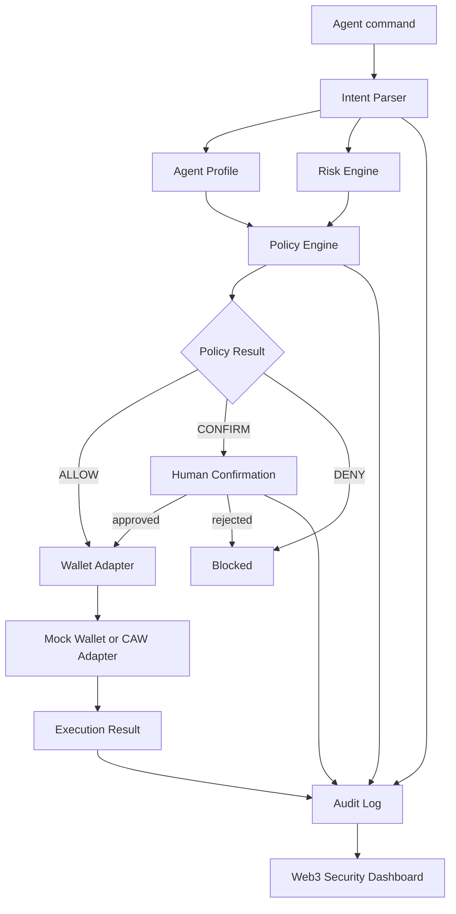
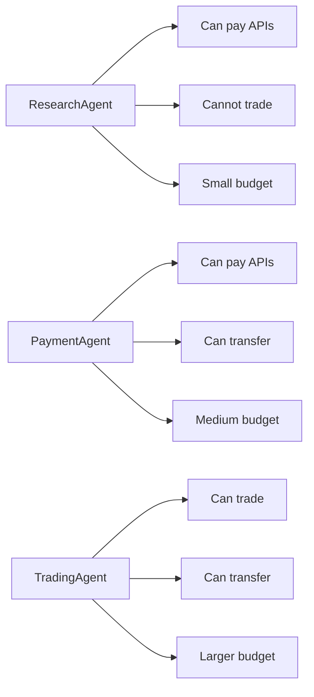
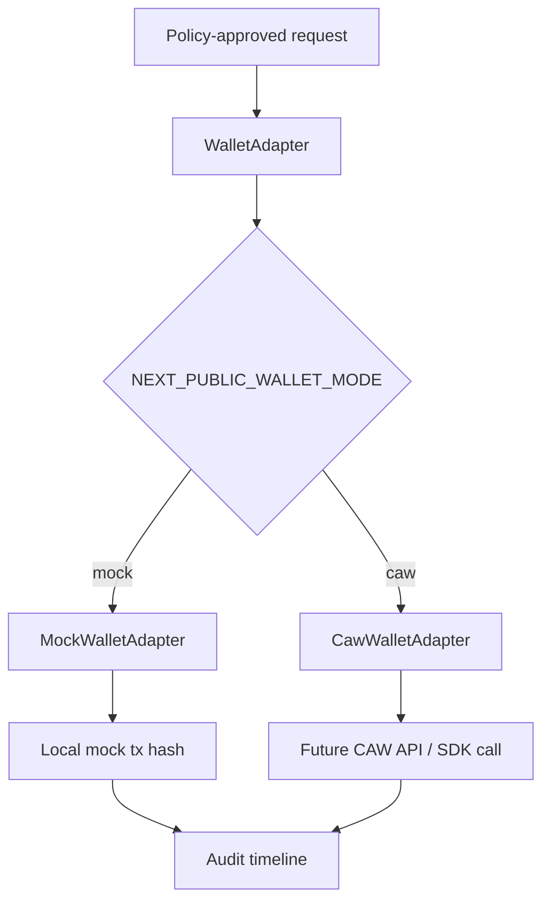
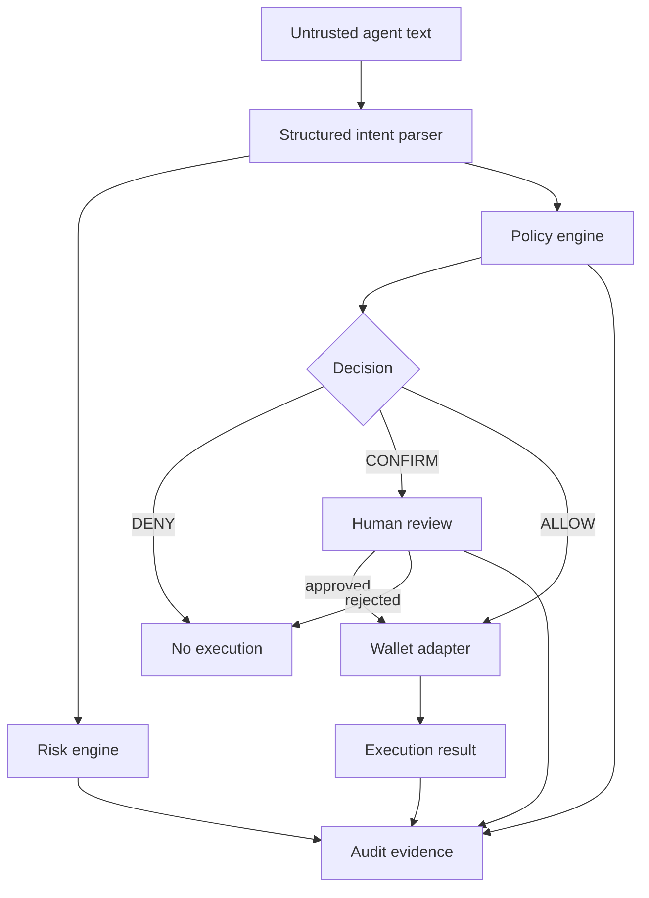

# Guardian Agent Wallet

AI explains. Policy decides. Wallet enforces. Human confirms. Audit records.

Guardian Agent Wallet is a Cobo Agentic Wallet hackathon MVP for safe AI-agent-controlled onchain execution. It shows how an AI agent can request wallet actions while a deterministic security layer evaluates intent, risk, agent permissions, human confirmation requirements, wallet execution, and audit evidence before any real funds move.

The current implementation is a working local demo with mock execution plus a CAW-ready wallet adapter boundary.

## Problem

AI agents are becoming capable of paying for APIs, buying data, calling services, trading assets, and operating wallet flows. That creates a practical safety gap:

- agent output is probabilistic,
- wallet actions are irreversible,
- prompts can be manipulated,
- tool responses can be forged,
- spending limits and permissions are often implicit,
- users need an audit trail after something goes wrong.

Guardian Agent Wallet turns agent wallet execution into a staged, inspectable flow instead of a direct "agent says, wallet signs" path.

## Why AI Agents Need Wallet Safety

AI agents need wallets to complete commercial and autonomous workflows, but they should not receive broad signing power. A safe agent wallet needs:

- identity: which agent is acting,
- capability limits: what the agent can do,
- budget limits: how much it can spend,
- recipient controls: where funds or approvals can go,
- token controls: what assets are in scope,
- risk explanations: why a transaction is safe or dangerous,
- human confirmation: when automation should stop,
- audit records: what happened and why.

The goal is not blind automatic payment. The goal is bounded autonomous execution.

## Architecture



The app is organized around stable boundaries:

- `lib/intentParser.ts`: parses simple Chinese and English demo commands.
- `lib/agentProfiles.ts`: defines ResearchAgent, PaymentAgent, and TradingAgent permissions.
- `lib/policyEngine.ts`: returns `ALLOW`, `CONFIRM`, or `DENY`.
- `lib/riskEngine.ts`: computes risk score, warnings, and human-readable explanations.
- `lib/wallets/*`: provides mock and CAW wallet adapters behind one interface.
- `lib/auditLog.ts`: stores execution timelines in localStorage.
- `components/SecurityDashboard.tsx`: renders Dashboard, Risk Review, and Audit Timeline views.

## Policy Engine

The policy engine evaluates deterministic rules before wallet execution. It supports:

- `AgentPermissionPolicy`
- `DailyBudgetPolicy`
- `SinglePaymentLimitPolicy`
- `TrustedRecipientPolicy`
- `UnlimitedApprovalPolicy`
- `AllowedTokenPolicy`
- `TimeWindowPolicy`

Each policy returns a structured result. The final decision includes:

```ts
{
  decision: "ALLOW" | "CONFIRM" | "DENY",
  riskLevel: "LOW" | "MEDIUM" | "HIGH",
  score: number,
  reason: string,
  triggeredRules: string[]
}
```

Agent profiles change the policy envelope:



## Risk Engine

The risk engine is separate from policy. It does not decide execution by itself; it explains risk and feeds the policy result.

Inputs:

- `PaymentRequest`

Outputs:

```ts
{
  riskScore: number,
  riskLevel: "LOW" | "MEDIUM" | "HIGH",
  explanation: string,
  warnings: string[]
}
```

Risk factors:

- amount,
- unknown recipient,
- approval request,
- unsupported token,
- suspicious contract.

Example explanation:

> This transaction grants unlimited spending permission to an unknown contract.

## CAW Integration

Wallet execution is routed through a common adapter:

```ts
interface WalletAdapter {
  getWalletInfo(): Promise<WalletInfo>;
  executePayment(input: ExecutePaymentInput): Promise<WalletExecutionResult>;
  getTransactionStatus(txHash: string): Promise<TransactionStatus>;
}
```

Runtime modes:

- `mock`: deterministic local execution for demo and tests.
- `caw`: CAW integration placeholder behind the same adapter interface.



Configuration:

```bash
NEXT_PUBLIC_WALLET_MODE=mock
NEXT_PUBLIC_CAW_API_BASE_URL=
NEXT_PUBLIC_CAW_WALLET_ID=
```

CAW mode is intentionally not wired to real funds yet. The adapter file `lib/wallets/cawWallet.ts` is the extension point for real CAW SDK or API calls after policy, confirmation, and audit checks are stable.

## Demo Scenarios

Run locally:

```bash
npm.cmd install
npm.cmd run dev
```

Open [http://localhost:3000](http://localhost:3000).

Pages:

- Dashboard: `/`
- Risk Review: `/risk-review`
- Audit Timeline: `/audit-timeline`

Suggested scenarios:

- `买 10 USDC 的 ETH`: low-risk swap/payment flow under TradingAgent.
- `买 200 USDC 的 ETH`: larger amount, profile-dependent behavior.
- `转账 20 USDC 给 0xBAD`: suspicious recipient warning.
- `approve unlimited USDC`: denied unlimited approval.
- Switch to ResearchAgent and try a trade: denied by agent permission.
- Confirm a `CONFIRM` request: records `User Confirmed` and `Transaction Executed`.
- Reject a `CONFIRM` request: records user rejection without wallet execution.

## Future Work

- Replace the CAW placeholder with real Cobo Agentic Wallet execution.
- Add server-side signed audit records instead of browser-only localStorage.
- Add policy persistence and admin editing.
- Support session keys, spending windows, and scoped wallet permissions.
- Add x402 facilitator integration for paid API flows.
- Add richer intent parsing for contract calls and structured transaction calldata.
- Add simulation and token allowance checks before wallet execution.
- Add end-to-end browser tests for demo flows.

## Security Design

Guardian Agent Wallet follows a defense-in-depth model:



Design principles:

- Prompts do not override policy.
- Tool output does not override wallet permissions.
- Agent profile permissions are checked before execution.
- Unlimited approvals are denied.
- Suspicious recipients trigger high-risk review.
- Human confirmation is required for medium/high-risk flows.
- Every meaningful step becomes an audit event.
- Wallet SDKs stay behind `WalletAdapter`, not inside UI components.

Current boundary:

- This MVP does not move real funds.
- Mock mode is suitable for hackathon demos.
- CAW mode is an adapter placeholder ready for real integration.
