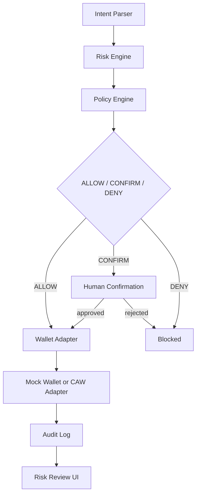
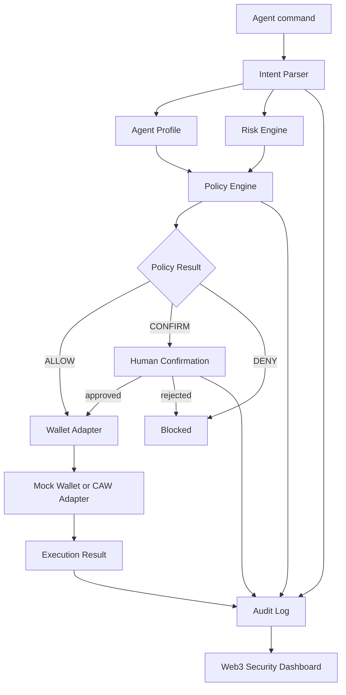

# Guardian Agent Wallet

AI explains. Policy decides. Wallet enforces. Human confirms. Audit records.

Guardian Agent Wallet is positioned as:

> CAW-powered policy layer for safe agent payments.

It is a Cobo Agentic Wallet hackathon MVP that shows how an AI agent can request payments while a deterministic security layer evaluates intent, risk, agent permissions, human confirmation requirements, wallet execution, and audit evidence before funds move.

The current implementation is a working local demo with mock execution plus a CAW-ready wallet adapter boundary.

## Problem

AI agents are becoming capable of paying for APIs, buying data, calling services, trading assets, and operating wallet flows. That creates a practical safety gap:

- agent output is probabilistic,
- wallet actions are irreversible,
- prompts can be manipulated,
- tool responses can be forged,
- spending limits and permissions are often implicit,
- users need an audit trail after something goes wrong.

Guardian Agent Wallet turns agent wallet execution into a staged, inspectable flow instead of a direct "agent says, wallet signs" path.

## Track

Cobo Agentic Wallet Hackathon.

The Cobo track requirement is that the project should eventually execute payments through Cobo Agentic Wallet, not only through a mock wallet.

## MVP Flow



Required MVP outcomes:

- Low-risk small payment: `ALLOW`
- Over-budget payment: `CONFIRM`
- Suspicious recipient: `CONFIRM`
- Unlimited approval: `DENY`

## Architecture

The app is organized around stable module boundaries:

- `lib/intent/intentParser.ts`: parses simple Chinese and English demo commands.
- `lib/risk/riskEngine.ts`: computes risk score, warnings, and human-readable explanations.
- `lib/policy/agentProfiles.ts`: defines ResearchAgent, PaymentAgent, and TradingAgent permissions.
- `lib/policy/policyEngine.ts`: returns `ALLOW`, `CONFIRM`, or `DENY`.
- `lib/policy/securityConfig.ts`: shared token, recipient, and suspicious-address helpers.
- `lib/wallets/*`: provides mock and CAW wallet adapters behind one interface.
- `lib/audit/auditLog.ts`: stores execution timelines in localStorage.
- `components/SecurityDashboard.tsx`: renders Dashboard, Risk Review, and Audit Timeline views.



## Tech Stack

- Next.js App Router
- React
- TypeScript
- Tailwind CSS
- lucide-react icons
- Node.js built-in test runner with `tsx`
- Browser localStorage for MVP audit persistence
- Wallet adapter abstraction for mock and CAW modes

## Policy Engine

The policy engine evaluates deterministic rules before wallet execution:

- `AgentPermissionPolicy`
- `UnknownActionPolicy`
- `UnlimitedApprovalPolicy`
- `AllowedTokenPolicy`
- `TrustedRecipientPolicy`
- `SinglePaymentLimitPolicy`
- `DailyBudgetPolicy`
- `TimeWindowPolicy`

The final decision includes:

```ts
{
  decision: "ALLOW" | "CONFIRM" | "DENY",
  riskLevel: "LOW" | "MEDIUM" | "HIGH",
  score: number,
  reason: string,
  triggeredRules: string[]
}
```

## Risk Engine

The risk engine explains risk and feeds the policy result. It evaluates:

- amount,
- unknown recipient,
- approval request,
- unsupported token,
- suspicious contract.

Example explanation:

> This transaction grants unlimited spending permission to an unknown contract.

## CAW Integration

Wallet execution is routed through a common adapter:

```ts
interface WalletAdapter {
  getWalletInfo(): Promise<WalletInfo>;
  executePayment(input: ExecutePaymentInput): Promise<WalletExecutionResult>;
  getTransactionStatus(txHash: string): Promise<TransactionStatus>;
}
```

Runtime modes:

- `mock`: deterministic local execution for demo and tests.
- `caw`: CAW placeholder adapter. If credentials are missing, the adapter layer falls back to mock mode for demo continuity.

Configuration:

```bash
NEXT_PUBLIC_WALLET_MODE=mock
NEXT_PUBLIC_CAW_API_BASE_URL=
NEXT_PUBLIC_CAW_WALLET_ID=
```

Real CAW execution is intentionally not implemented yet. The extension point is `lib/wallets/cawWallet.ts`.

## Demo Scenarios

Run locally:

```bash
npm.cmd install
npm.cmd run dev
```

Open [http://localhost:3000](http://localhost:3000).

Pages:

- Dashboard: `/`
- Risk Review: `/risk-review`
- Audit Timeline: `/audit-timeline`

Suggested scenarios:

- Small payment under the selected agent profile limit: `ALLOW`
- Payment above the selected agent profile limit: `CONFIRM`
- Transfer to `0xBAD`: suspicious recipient `CONFIRM`
- `approve unlimited USDC`: `DENY`
- Switch to ResearchAgent and try a trade: denied by agent permission.
- Confirm a `CONFIRM` request: records `User Confirmed` and `Transaction Executed`.
- Reject a `CONFIRM` request: records user rejection without wallet execution.

## Risks

- Real CAW execution is not implemented yet.
- Current audit persistence is browser localStorage only.
- Risk scoring is deterministic and demo-oriented, not production-grade contract intelligence.
- Intent parsing supports only simple demo commands.
- CAW mode requires real credentials and API shape confirmation before funds can move.
- Mock fallback is useful for demo continuity, but production should make fallback behavior explicit to the user.

## Validation Plan

Current validation:

```bash
npm.cmd run test
npm.cmd run lint
npm.cmd run build
```

Expected checks:

- Unit tests cover policy, risk, and audit behavior.
- Lint must pass.
- Next.js production build must pass.
- Manual demo should verify:
  - low-risk payment -> `ALLOW`,
  - over-budget payment -> `CONFIRM`,
  - suspicious recipient -> `CONFIRM`,
  - unlimited approval -> `DENY`,
  - audit timeline records intent, policy, confirmation, and execution events.

## Future Work

- Replace the CAW placeholder with real Cobo Agentic Wallet execution.
- Add server-side signed audit records instead of browser-only localStorage.
- Add policy persistence and admin editing.
- Support session keys, spending windows, and scoped wallet permissions.
- Add x402 facilitator integration for paid API flows.
- Add richer intent parsing for contract calls and structured transaction calldata.
- Add simulation and token allowance checks before wallet execution.
- Add end-to-end browser tests for demo flows.

## Security Design

- Prompts do not override policy.
- Tool output does not override wallet permissions.
- Agent profile permissions are checked before execution.
- Unlimited approvals are denied.
- Suspicious recipients trigger high-risk review.
- Human confirmation is required for medium/high-risk flows.
- Every meaningful step becomes an audit event.
- Wallet SDKs stay behind `WalletAdapter`, not inside UI components.
