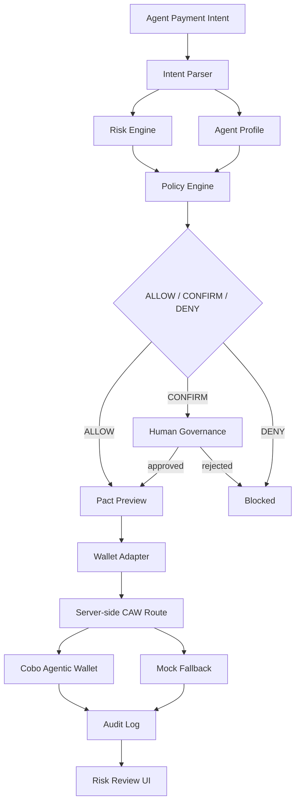

# Guardian Agent Wallet

Policy-Aware Agent Payment Framework Built on Cobo Agentic Wallet

基于 Cobo Agentic Wallet 构建的策略感知型 Agent 支付框架

```text
AI explains.
Policy decides.
CAW executes.
Human governs.
Audit records.
```

```text
AI 解释意图。
策略判断风险。
CAW 执行支付。
人类治理边界。
审计记录全过程。
```

Guardian Agent Wallet is a policy-aware execution framework for agent-native payments. It is not a simple wallet UI or a generic AI chatbot. An AI agent can propose a payment, but deterministic risk, policy, governance, and audit layers decide whether that payment can proceed, requires human confirmation, or must be blocked.

## Problem

AI agents are starting to buy APIs, data, compute, and services. In Web3, those actions can involve irreversible wallet execution. That creates a practical safety gap:

- agent output is probabilistic,
- prompts can be manipulated,
- tool responses can be forged,
- approvals can create future wallet-drain risk,
- budgets and permissions are often implicit,
- users need evidence after payment execution.

The unsafe path is:

```text
Agent says pay -> wallet signs
```

Guardian Agent Wallet turns that into a staged, inspectable flow.

## Solution

Guardian Agent Wallet adds a policy-aware safety layer between AI agent intent and Cobo Agentic Wallet execution.

It provides:

- intent parsing for realistic Agentic Payment and API/SaaS payment requests,
- explainable risk scoring,
- agent-specific permission profiles,
- deterministic policy decisions,
- human confirmation for medium/high-risk flows,
- CAW execution through a server-side route,
- audit timeline records for intent, policy, confirmation, and execution.

## Architecture



Core modules:

- `lib/intent/intentParser.ts`: parses simple Chinese and English agent payment commands.
- `lib/risk/riskEngine.ts`: computes risk score, risk level, warnings, and explanation.
- `lib/risk/riskContributions.ts`: explains score contributions in Chinese.
- `lib/policy/agentProfiles.ts`: defines Research Agent, Payment Agent, and Trading Agent permissions.
- `lib/policy/policyEngine.ts`: evaluates `ALLOW`, `CONFIRM`, or `DENY`.
- `lib/policy/pactPreview.ts`: builds a UI-ready execution scope preview.
- `lib/wallets/cawWallet.ts`: frontend CAW adapter that calls the server API route.
- `lib/wallets/cawServer.ts`: server-side CAW execution helper.
- `app/api/caw/execute-payment/route.ts`: server-only CAW payment execution route.
- `lib/audit/auditLog.ts`: browser localStorage audit timeline for MVP evidence.
- `components/SecurityDashboard.tsx`: dashboard, risk review, and audit views.

## Demo Flow

Run locally:

```bash
npm.cmd install
npm.cmd run dev
```

Open [http://localhost:3000](http://localhost:3000).

Use the dashboard in this order:

1. Select an Agent Profile.
2. Pick a realistic Agentic Payment request or an Attack Simulation scenario.
3. Review parsed intent and transaction preview.
4. Inspect Risk Intelligence: score, level, triggered rules, and contribution breakdown.
5. Review Pact Preview: amount, token, recipient, budget, execution mode, and human approval requirement.
6. Execute only an allowed or confirmed safe payment.
7. Open Audit Timeline to show recorded evidence.

Default payment request scenarios:

| Scenario | Command | Trusted recipient alias | Expected decision |
| --- | --- | --- | --- |
| 数据 API 服务商 | `支付 0.001 SETH 给 数据 API 服务商` | `data-api-provider` | `ALLOW` |
| AI 推理服务 | `支付 0.005 SETH 给 AI 推理服务` | `ai-inference-service` | `ALLOW` |
| 链上分析 API | `支付 0.01 SETH 给 链上分析 API` | `onchain-analytics-api` | `ALLOW` |
| 高级研究数据源 | `支付 0.05 SETH 给 高级研究数据源` | `premium-research-feed` | `ALLOW` |

Attack simulation scenarios:

| Scenario | Command | Expected decision |
| --- | --- | --- |
| 超预算 API 支付 | `支付 10 SETH 给 数据 API 服务商` | `CONFIRM` |
| 可疑收款方 | `支付 0.001 SETH 给 0xBAD0000000000000000000000000000000000000` | `CONFIRM` |
| 无限授权攻击 | `approve unlimited USDC` | `DENY` |
| 未授权服务商 | `支付 0.001 SETH 给 unknown-vendor` | `CONFIRM` |

Trusted recipient aliases:

- `data-api-provider`: 数据 API 服务商
- `ai-inference-service`: AI 推理服务
- `onchain-analytics-api`: 链上分析 API
- `premium-research-feed`: 高级研究数据源

For UI, policy, and demo scripts, these aliases are the stable business identifiers. For real CAW execution, the server resolves them to EVM addresses using `lib/wallets/recipientResolver.ts`.

Agent governance comparison:

- Research Agent can pay trusted API/data services but cannot trade.
- Payment Agent can make small API/SaaS payments and transfers inside budget.
- Trading Agent has a larger budget for swap/transfer flows, while approval remains restricted.

## CAW Integration

Cobo Agentic Wallet is used as the execution layer through a server-side CAW path.

The frontend:

- reads only `NEXT_PUBLIC_WALLET_MODE` for mode display,
- calls `/api/caw/execute-payment`,
- never reads CAW credentials,
- never receives `AGENT_WALLET_API_KEY`.

The server route:

- lives at `app/api/caw/execute-payment/route.ts`,
- reads server-only `AGENT_WALLET_*` environment variables,
- resolves trusted service aliases to EVM addresses server-side,
- calls `lib/wallets/cawServer.ts`,
- supports the MVP small `SETH` transfer path,
- returns wallet address, request ID, receipt ID, and tx hash only when CAW returns them.

Recipient resolution is server-side:

- UI may send `data-api-provider` or `数据 API 服务商`.
- The server resolves the alias through `CAW_RECIPIENT_DATA_API`, `CAW_RECIPIENT_AI_INFERENCE`, `CAW_RECIPIENT_ONCHAIN_ANALYTICS`, or `CAW_RECIPIENT_RESEARCH_FEED`.
- In local demo mode only, missing recipient-specific env vars may fall back to `CAW_DESTINATION` and the UI marks that address as fallback.
- API keys remain server-only and are never returned to the frontend.

## Runtime Modes

| Mode | Meaning |
| --- | --- |
| Mock Mode | Deterministic local wallet execution for tests and demos. |
| CAW Fallback Mode | CAW mode is selected, but mock mode is enabled or server credentials are missing. The UI labels fallback explicitly. |
| Real CAW Mode | Server credentials exist, mock mode is off, and the server-side route attempts real CAW execution for the supported MVP transfer. |

Environment configuration:

```bash
NEXT_PUBLIC_WALLET_MODE=caw
CAW_MOCK_MODE=false
AGENT_WALLET_API_URL=https://api.agenticwallet.cobo.com
AGENT_WALLET_API_KEY=<server-only>
AGENT_WALLET_WALLET_ID=<wallet-uuid>
AGENT_WALLET_PACT_ID=<pact-id>
CAW_DESTINATION=<local-demo-fallback-recipient>
CAW_RECIPIENT_DATA_API=<evm-address>
CAW_RECIPIENT_AI_INFERENCE=<evm-address>
CAW_RECIPIENT_ONCHAIN_ANALYTICS=<evm-address>
CAW_RECIPIENT_RESEARCH_FEED=<evm-address>
```

## Security Boundary

- API keys are server-only.
- `.env.local` must not be committed.
- Frontend code must not reference `AGENT_WALLET_API_KEY`.
- Wallet SDK calls stay behind the server-side route.
- Prompts do not override policy.
- Tool output does not override wallet permissions.
- Unlimited approvals are denied.
- Suspicious recipients require review.
- Human governance is required before medium/high-risk execution.

## Evidence Caveat

The project must not fake transaction evidence.

- A real tx hash should be displayed only when CAW returns a real tx hash.
- A receipt ID or request ID should be displayed only when CAW returns it.
- If the transaction hash or receipt is pending, docs and UI should say pending rather than inventing `0x...` evidence.

## Tech Stack

- Next.js App Router
- React
- TypeScript
- Tailwind CSS
- lucide-react icons
- `@cobo/agentic-wallet`
- Node.js built-in test runner with `tsx`
- Browser localStorage for MVP audit persistence

## Validation Plan

```bash
npm.cmd run test
npm.cmd run lint
npm.cmd run build
```

Manual demo checks:

- trusted small API/SaaS payment -> `ALLOW`,
- over-budget API payment -> `CONFIRM`,
- suspicious recipient -> `CONFIRM`,
- unlimited approval -> `DENY`,
- unauthorized vendor -> `CONFIRM`,
- agent profile changes re-evaluate the current request,
- Pact Preview appears before execution,
- Audit Timeline records intent, policy, confirmation, and execution metadata,
- UI clearly labels Mock Mode, CAW Fallback Mode, or Real CAW Mode.

## Risks And Caveats

- Intent parsing supports only simple demo commands.
- Trusted service aliases are resolved server-side before real CAW execution; production use should verify and manage those payee addresses operationally.
- Risk scoring is deterministic and MVP-oriented, not production-grade contract intelligence.
- CAW execution currently focuses on one MVP action: small `SETH` transfer.
- Audit persistence is browser localStorage only.
- Real tx hash may not be available immediately; display it only when returned by CAW.
- Mock fallback is useful for demo continuity but must remain clearly labeled.

## Future Work

- Add editable verified service registry management for trusted recipient addresses.
- Add more CAW-supported payment and contract-call actions.
- Add server-side signed audit records.
- Add policy persistence and admin editing.
- Add x402 facilitator integration for paid API flows.
- Add transaction simulation, allowance checks, and contract reputation.
- Add end-to-end browser tests for the demo flow.
