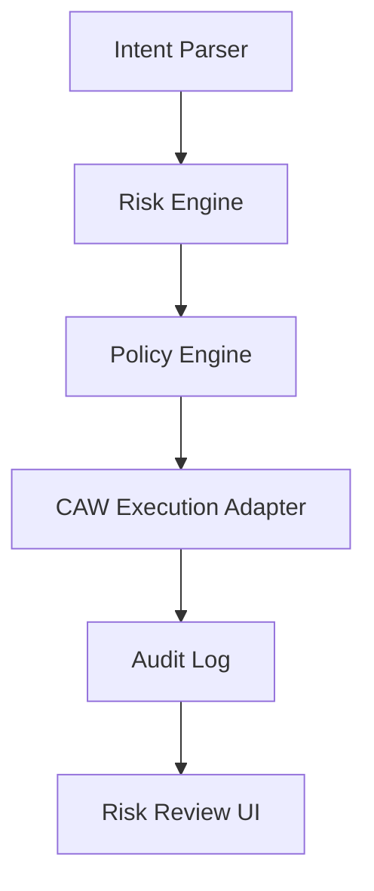

# Project Vision

Guardian Agent Wallet is now positioned as:

> CAW-powered policy layer for safe agent payments.

The project explores how AI agents can safely pay for APIs, services, data, and onchain actions without receiving broad wallet authority. The core idea is to place a deterministic policy and risk layer between an agent's intent and wallet execution.

## Problem

AI agents can generate useful payment intents, but wallet execution is irreversible and adversarial surfaces are wide:

- prompt injection can alter instructions,
- tool output can be forged,
- approvals can create long-lived spending risk,
- recipients may be unknown or malicious,
- budgets and scopes need to be explicit,
- users need clear audit records.

Guardian Agent Wallet turns agent payment into a staged flow where intent is parsed, risk is explained, policy is enforced, and wallet execution is auditable.

## Direction

The long-term direction is not "mock wallet safety." The Cobo track requirement is that the project should eventually execute payments through Cobo Agentic Wallet, not only a mock wallet.

The current MVP keeps wallet execution abstracted behind a wallet adapter so the project can demonstrate the safety layer now and connect real CAW execution later.

## Core Workflow

## MVP Principles

- Keep the demo small and understandable.
- Preserve the working UI.
- Make safety decisions deterministic.
- Make risk explanations readable.
- Keep CAW as the eventual execution path.
- Avoid direct wallet execution from UI components.

## TODO

- Replace placeholder CAW execution with real Cobo Agentic Wallet calls.
- Define the exact paid API scenario for the final hackathon demo.
- Add a concise demo video script once CAW execution is available.
