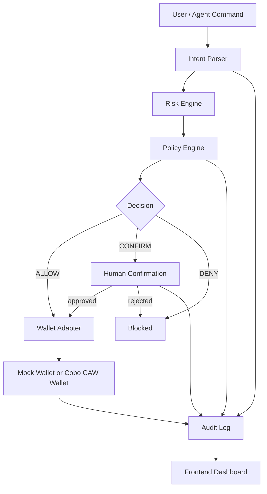
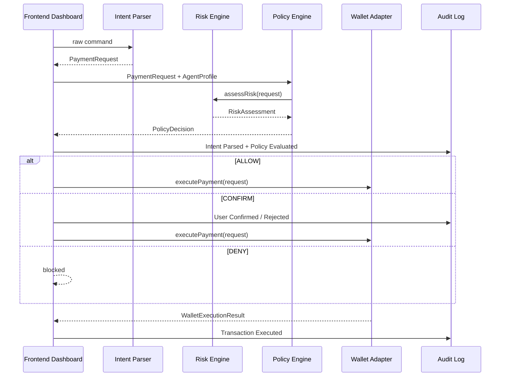

# System Architecture

Guardian Agent Wallet follows a layered architecture. The UI never calls a concrete wallet implementation directly; it works through the policy, risk, audit, and wallet adapter layers.

## High-Level Flow

## Current Files

- `lib/intent/intentParser.ts`: parses raw commands.
- `lib/risk/riskEngine.ts`: scores transaction risk.
- `lib/policy/policyEngine.ts`: decides `ALLOW`, `CONFIRM`, or `DENY`.
- `lib/policy/agentProfiles.ts`: defines agent permission profiles.
- `lib/policy/securityConfig.ts`: central allowlists and suspicious address helpers.
- `lib/wallets/walletAdapter.ts`: wallet adapter interface.
- `lib/wallets/mockWallet.ts`: deterministic mock execution.
- `lib/wallets/cawWallet.ts`: frontend CAW adapter that calls the server API route.
- `lib/wallets/cawServer.ts`: server-side CAW execution helper.
- `app/api/caw/execute-payment/route.ts`: server API route for CAW execution and fallback handling.
- `lib/audit/auditLog.ts`: local audit record and timeline generation.
- `components/SecurityDashboard.tsx`: main dashboard orchestration.

## Data Flow

## TODO

- Keep the new module folders stable as implementation grows:
  - `lib/intent/`
  - `lib/risk/`
  - `lib/policy/`
  - `lib/audit/`
- Extract dashboard orchestration into a hook.
- Keep route pages thin and UI components presentational.
