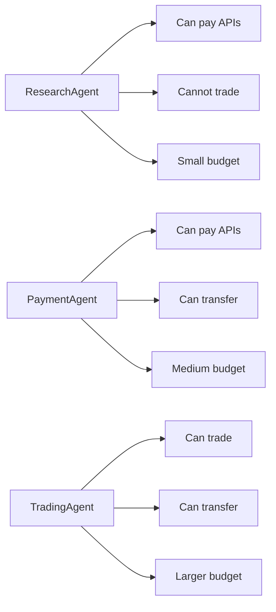

# Policy Engine

The policy engine determines whether a parsed payment request should be allowed, require human confirmation, or be denied.

## Current File

- `lib/policy/policyEngine.ts`
- `lib/policy/agentProfiles.ts`
- `lib/policy/securityConfig.ts`

## Inputs

- `PaymentRequest`
- `AgentProfile`
- optional `PolicyContext`
- optional policy rule list

## Output

```ts
{
  decision: "ALLOW" | "CONFIRM" | "DENY",
  riskLevel: "LOW" | "MEDIUM" | "HIGH",
  score: number,
  reason: string,
  triggeredRules: string[]
}
```

## Current Policies

- `AgentPermissionPolicy`
- `UnknownActionPolicy`
- `UnlimitedApprovalPolicy`
- `AllowedTokenPolicy`
- `TrustedRecipientPolicy`
- `SinglePaymentLimitPolicy`
- `DailyBudgetPolicy`
- `TimeWindowPolicy`

## Agent Profiles



## Decision Meaning

- `ALLOW`: request can proceed to wallet adapter.
- `CONFIRM`: user must explicitly approve before wallet adapter execution.
- `DENY`: no wallet execution should be available.

## TODO

- Keep policy code inside `lib/policy/`.
- Add policy unit tests for CAW-specific session scopes.
- Add policy configuration persistence for demo operators.
- Make daily spent dynamic instead of static context input.
