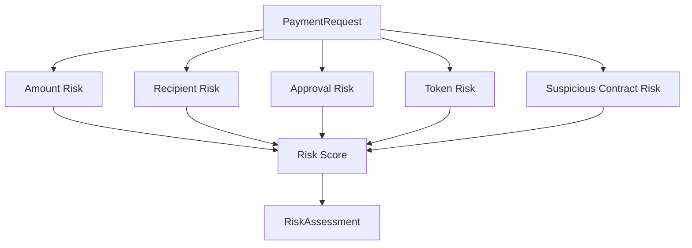

# Risk Engine

The risk engine produces human-readable transaction risk information. It does not decide execution by itself; the policy engine uses its output when building the final policy decision.

## Current File

- `lib/risk/riskEngine.ts`

## Input

- `PaymentRequest`

## Output

```ts
{
  riskScore: number,
  riskLevel: "LOW" | "MEDIUM" | "HIGH",
  explanation: string,
  warnings: string[]
}
```

## Risk Factors

- amount,
- unknown recipient,
- approval request,
- unsupported token,
- suspicious contract.

## Example Explanation

```text
This transaction grants unlimited spending permission to an unknown contract.
```

## Risk Flow



## TODO

- Keep risk code inside `lib/risk/`.
- Make thresholds configurable per agent profile.
- Add warnings for stale prices, non-standard tokens, and contract simulation failures.
- Add UI section that shows individual risk warnings, not only combined reason text.
