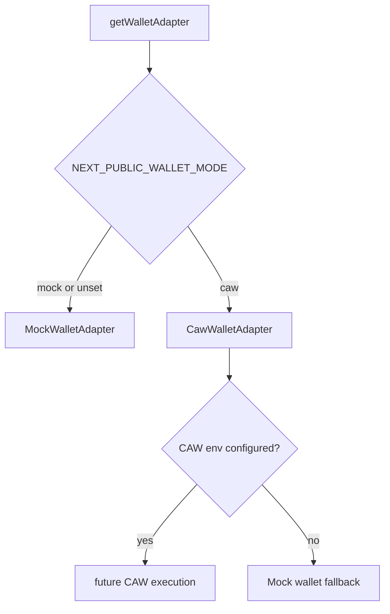

# Wallet Adapter

The wallet adapter isolates execution from the UI and policy layers. The dashboard should depend on the adapter interface, not a concrete wallet SDK.

## Current Files

- `lib/wallets/walletAdapter.ts`
- `lib/wallets/mockWallet.ts`
- `lib/wallets/cawWallet.ts`
- `lib/wallets/cawConfig.ts`
- `lib/wallets/cawTypes.ts`
- `lib/wallets/index.ts`
- `lib/mockWallet.ts` legacy compatibility re-export

## Interface

```ts
interface WalletAdapter {
  mode: WalletMode;
  getWalletInfo(): Promise<WalletInfo>;
  executePayment(input: ExecutePaymentInput): Promise<WalletExecutionResult>;
  getTransactionStatus(txHash: string): Promise<TransactionStatus>;
}
```

## Current Modes

- `mock`: returns deterministic local mock transaction results.
- `caw`: placeholder adapter for future Cobo Agentic Wallet execution. If credentials are missing, the adapter layer falls back to mock mode for demo continuity.

## Adapter Selection



## TODO

- Add tests for mock fallback when CAW credentials are missing.
- Remove `lib/mockWallet.ts` compatibility re-export after imports are migrated.
- Add adapter tests for failure and pending status behavior.
- Add real transaction status polling once CAW execution is connected.
