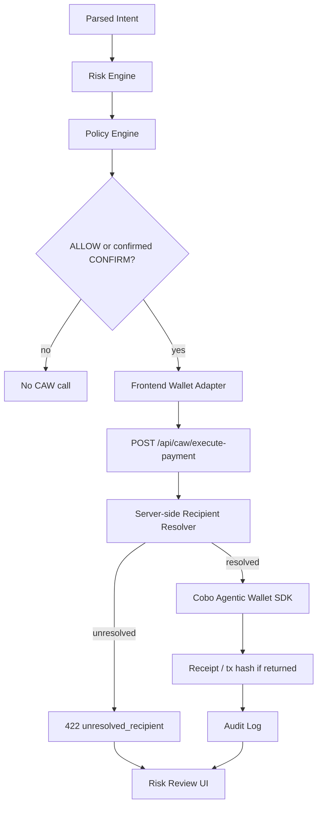

# Cobo CAW Integration

Guardian Agent Wallet is a Policy-Aware Agent Payment Framework Built on Cobo Agentic Wallet.

基于 Cobo Agentic Wallet 构建的策略感知型 Agent 支付框架。

## Positioning

This is a policy-aware execution framework for agent-native payments.

```text
AI explains.
Policy decides.
CAW executes.
Human governs.
Audit records.
```

```text
AI 解释意图。
策略判断风险。
CAW 执行支付。
人类治理边界。
审计记录全过程。
```

## Current State

The project has a CAW-ready and CAW-integrated execution adapter:

- `lib/wallets/cawWallet.ts`: frontend adapter that calls the server API route.
- `app/api/caw/execute-payment/route.ts`: server-side CAW execution route.
- `lib/wallets/cawServer.ts`: server-only CAW SDK integration helper.
- `lib/wallets/cawConfig.ts`: server-only CAW credential configuration.
- `lib/wallets/recipientResolver.ts`: server-side trusted recipient alias resolver.
- `lib/wallets/mockWallet.ts`: deterministic mock fallback.

The frontend does not import the CAW SDK and does not read CAW credentials. API keys are server-only.

## CAW Flow



## Required Environment

Frontend:

```bash
NEXT_PUBLIC_WALLET_MODE=caw
```

Server-only:

```bash
CAW_MOCK_MODE=false
AGENT_WALLET_API_URL=https://api.agenticwallet.cobo.com
AGENT_WALLET_API_KEY=<server-only>
AGENT_WALLET_WALLET_ID=<wallet-uuid>
AGENT_WALLET_PACT_ID=<pact-id>
```

Trusted recipient addresses:

```bash
CAW_RECIPIENT_DATA_API=<evm-address>
CAW_RECIPIENT_AI_INFERENCE=<evm-address>
CAW_RECIPIENT_ONCHAIN_ANALYTICS=<evm-address>
CAW_RECIPIENT_RESEARCH_FEED=<evm-address>
```

Local demo fallback:

```bash
CAW_DESTINATION=<evm-address>
```

`CAW_DESTINATION` is only a local demo fallback when a recipient-specific address is missing. The UI marks fallback use explicitly.

`NEXT_PUBLIC_WALLET_MODE` is only for frontend mode display and adapter selection. Do not expose `AGENT_WALLET_API_KEY` to client components, browser code, screenshots, or docs.

## Recipient Resolution

UI and policy can use stable service aliases:

- `data-api-provider`
- `ai-inference-service`
- `onchain-analytics-api`
- `premium-research-feed`

The resolver also accepts Chinese and English display names:

- 数据 API 服务商 / Data API Provider
- AI 推理服务 / AI Inference Service
- 链上分析 API / Onchain Analytics API
- 高级研究数据源 / Premium Research Feed

Before CAW execution, the server resolves the alias to a real EVM address and submits that address as `dst_addr`.

If resolution fails, the API returns:

```json
{
  "error": {
    "code": "unresolved_recipient",
    "reason": "Recipient must be a trusted alias or a valid EVM address."
  }
}
```

## Runtime Modes

- **Mock Mode**: local deterministic execution for tests and demo continuity.
- **CAW Fallback Mode**: CAW mode is requested, but `CAW_MOCK_MODE=true` or credentials are missing; the server route returns explicit fallback execution.
- **Real CAW Mode**: server credentials exist, mock mode is off, recipient is resolved, and the server-side route submits the supported MVP action through Cobo Agentic Wallet.

## MVP Action

The current real CAW execution scope is intentionally narrow:

- Network: Ethereum Sepolia (`SETH`)
- Token: `SETH`
- Action: small transfer
- Amount limit: at most `0.01 SETH`

Real tx hash / receipt should only be shown when returned by CAW. Do not invent a tx hash.

## Safety Boundary

CAW should only receive requests after:

1. intent parsing,
2. risk assessment,
3. policy evaluation,
4. human governance when required,
5. server-side recipient resolution,
6. audit record creation.

## TODO

- Add editable trusted recipient registry management.
- Add more CAW-supported actions beyond small `SETH` transfer.
- Add e2e browser coverage for Real CAW Mode and CAW Fallback Mode.
- Add server-side signed audit evidence for production use.
