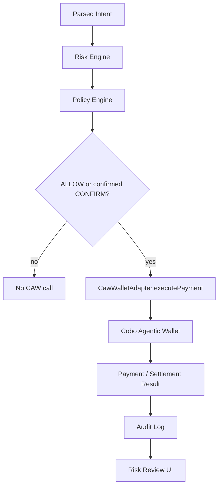

# Cobo CAW Integration

Guardian Agent Wallet should eventually execute payments through Cobo Agentic Wallet, not only the mock wallet.

## Current State

The current implementation has a CAW adapter placeholder:

- `lib/wallets/cawWallet.ts`
- `lib/wallets/cawConfig.ts`
- `lib/wallets/cawTypes.ts`

It implements the same `WalletAdapter` interface as the mock wallet. This keeps the rest of the app stable while CAW execution is added. When CAW mode is requested but credentials are missing, the adapter selection falls back to mock mode so the existing demo remains usable.

## Intended CAW Flow



## Required Environment

```bash
NEXT_PUBLIC_WALLET_MODE=caw
NEXT_PUBLIC_CAW_API_BASE_URL=
NEXT_PUBLIC_CAW_WALLET_ID=
```

## Safety Boundary

CAW should only receive requests after:

1. intent parsing,
2. risk assessment,
3. policy evaluation,
4. human confirmation when required,
5. audit record creation.

## TODO

- Confirm the exact Cobo CAW SDK/API shape.
- Replace placeholder CAW execution with real CAW payment execution.
- Expand credential readiness checks beyond `NEXT_PUBLIC_CAW_API_BASE_URL` and `NEXT_PUBLIC_CAW_WALLET_ID` once the real CAW API shape is known.
- Add receipt fields to `WalletExecutionResult`.
- Add tests for CAW mode without credentials and with mocked credentials.
