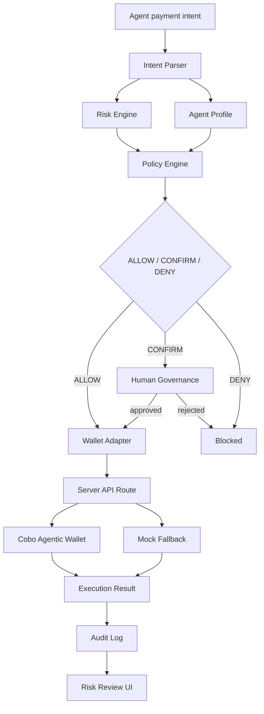

# Guardian Agent Wallet Architecture

Guardian Agent Wallet is a Policy-Aware Agent Payment Framework Built on Cobo Agentic Wallet.

基于 Cobo Agentic Wallet 构建的策略感知型 Agent 支付框架。

## Core Philosophy

```text
AI explains.
Policy decides.
CAW executes.
Human governs.
Audit records.
```

```text
AI 解释意图。
策略判断风险。
CAW 执行支付。
人类治理边界。
审计记录全过程。
```

## Runtime Flow

```text
Intent Parser
  -> Risk Engine
  -> Policy Engine
  -> Wallet Adapter
  -> Server-side CAW Execution Path
  -> Audit Log
  -> Risk Review UI
```



## Runtime Modes

- **Mock Mode**: local deterministic execution for demos and tests.
- **CAW Fallback Mode**: CAW mode is selected, but `CAW_MOCK_MODE=true` or server credentials are missing.
- **Real CAW Mode**: server credentials exist, mock mode is off, and the server API route executes the supported MVP transfer through Cobo Agentic Wallet.

Set frontend mode display and adapter selection with:

```bash
NEXT_PUBLIC_WALLET_MODE=mock
NEXT_PUBLIC_WALLET_MODE=caw
```

Server-side CAW execution uses:

```bash
CAW_MOCK_MODE=false
AGENT_WALLET_API_URL=https://api.agenticwallet.cobo.com
AGENT_WALLET_API_KEY=<server-only>
AGENT_WALLET_WALLET_ID=<wallet-uuid>
```

`AGENT_WALLET_API_KEY` must never be exposed to frontend code.

## Wallet Adapter Boundary

All wallet execution is routed through `WalletAdapter`:

- `getWalletInfo()`
- `executePayment()`
- `getTransactionStatus()`

The UI does not import CAW SDKs or server credentials. The frontend CAW adapter calls:

```text
/api/caw/execute-payment
```

The server route delegates to `lib/wallets/cawServer.ts`, which is the only module that imports `@cobo/agentic-wallet`.

## Agent Profiles

Agent profiles define the permission envelope before wallet execution:

- `ResearchAgent`: can pay allowlisted APIs, has a small budget, and cannot trade.
- `PaymentAgent`: can pay APIs and transfer to allowlisted recipients.
- `TradingAgent`: can trade and has a larger budget for demo scenarios.

The policy engine evaluates each request against the selected profile's allowed actions, daily budget, single-payment limit, recipients, and tokens. This keeps "what the agent wants" separate from "what this agent is allowed to do."

## Risk Intelligence

Risk Intelligence makes the risk layer explainable before CAW execution.

Implementation:

- `lib/risk/riskEngine.ts`: computes deterministic risk score, risk level, warnings, and human-readable explanation.
- `lib/risk/riskContributions.ts`: maps structured request facts into Chinese contribution items such as `+40 超预算`, `+25 未知或可疑收款方`, `+20 无限授权`, and `+10 不支持的 Token`.
- `components/RiskIntelligencePanel.tsx`: displays score, LOW / MEDIUM / HIGH level, circular meter, progress bar, triggered policy rules, Chinese explanation, and contribution breakdown.

The contribution model is intentionally deterministic for the MVP. It is not a substitute for production simulation, contract intelligence, or threat feeds, but it gives judges and users a clear answer to: "Why did the wallet stop or request confirmation?"

## Extension Points

- `lib/wallets/cawServer.ts`: add more CAW payment and contract-call actions.
- `lib/policy/policyEngine.ts`: add CAW-specific policy checks such as wallet scopes, session limits, spending windows, or allowlisted counterparties.
- `lib/risk/riskContributions.ts`: add richer risk signals such as contract reputation, allowance history, phishing feeds, or transaction simulation.
- `lib/audit/auditLog.ts`: extend local audit events into server-side evidence, signed receipts, or settlement records.
- `types/index.ts`: add protocol-specific request and receipt fields as the MVP supports more CAW actions.

## Safety Boundary

The policy engine must remain before wallet execution. CAW, Safe, ERC-4337, x402, or swap router integrations should never bypass:

1. intent parsing,
2. risk evaluation,
3. policy evaluation,
4. explicit human governance when required,
5. audit logging.

Real tx hash / receipt should only be shown when returned by CAW. Do not invent transaction evidence.
